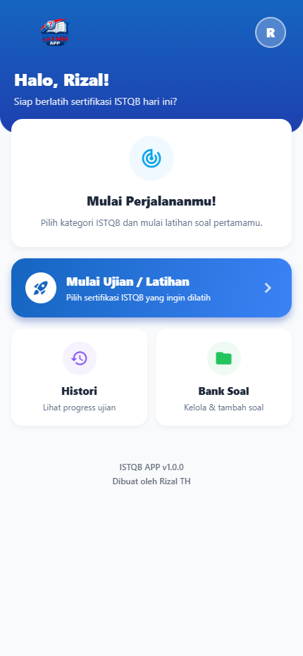

# ISTQB Simulator App 🎓



Aplikasi latihan ujian sertifikasi ISTQB (International Software Testing Qualifications Board) yang komprehensif, cepat, dan bekerja secara offline (Local First). Aplikasi ini dibangun dengan framework **React Native (Expo)** menggunakan SQLite untuk penyimpanan datanya.

## ✨ Fitur Utama

- **Offline-First & Cepat:** Semua soal dan histori disimpan secara lokal menggunakan `expo-sqlite`. Tidak membutuhkan koneksi internet untuk berlatih!
- **Sistem Tema Dinamis (Dark / Light Mode):** Antarmuka yang modern, dinamis, dan premium menggunakan `expo-linear-gradient`. Warna beradaptasi secara otomatis berdasarkan preferensi mode terang atau gelap pengguna.
- **Bank Soal & Lokalisasi:**
  - Dilengkapi dengan Bank Soal *built-in* Bahasa Indonesia dan Bahasa Inggris yang langsung dimuat (seeded) ke dalam database saat pertama kali dijalankan.
  - Tersedia UI CRUD lengkap untuk mengelola bank soal Anda sendiri (Tambah, Edit, Hapus soal lengkap dengan *Image Upload* menggunakan Base64 yang dioptimalkan untuk Web).
- **Manajemen Level & Kategori:** Pengguna dapat menambah, mengedit, dan menghapus level sertifikasi (misalnya CTFL, CTAL) beserta kategori topiknya, menjadikan aplikasi ini fleksibel untuk segala jenis latihan soal.
- **Dua Mode Utama:**
  - **Mode Latihan (Practice Mode):** Belajar santai tanpa timer. Setiap jawaban akan langsung menampilkan penjelasan (Kunci Jawaban & Alasan).
  - **Mode Ujian (Exam Mode):** Simulasi ujian sesungguhnya menggunakan pengatur waktu mundur (Timer) dan batas waktu layaknya ujian sertifikasi resmi.
- **Sistem Resume Ujian:** Jika Anda tidak sengaja keluar atau menunda ujian, progres akan disimpan otomatis di `AsyncStorage` sehingga Anda bisa melanjutkan ujian dari titik terakhir.
- **Skoring Lengkap & Histori:** Lacak persentase kelulusan Anda dan lihat ulang detail pembahasan jawaban benar dan salah di fitur riwayat (History).
- **Profil & Manajemen Data:** Kelola nama pengguna, lihat statistik komprehensif per kategori, impor ulang bank soal bawaan (CTFL), atau kosongkan database untuk memulai ulang.
- **Cross-Platform:** Berjalan optimal di Web, Android, maupun iOS.

---

## 🛠 Teknologi yang Digunakan

Aplikasi ini menggunakan teknologi React Native modern:
- **Framework:** Expo SDK 55 (React Native 0.83)
- **Routing:** Expo Router v55 (File-based routing)
- **Database:** `expo-sqlite` (dengan sistem OPFS untuk dukungan penyimpanan yang lebih kuat di Web)
- **State Management:** React Context API (`ThemeContext`, `SessionContext`, `BankTypeContext`, `I18nContext`, `DatabaseContext`)
- **Desain UI:** `expo-linear-gradient` dan kustomisasi gaya internal yang elegan.
- **Iconography:** Material Icons via `@expo/vector-icons`
- **Media:** `expo-image` dan `expo-image-picker`

---

## 🚀 Panduan Instalasi & Menjalankan Aplikasi

Aplikasi ini adalah proyek standar Expo. Ikuti langkah berikut untuk menjalankannya secara lokal:

### 1. Persiapan Awal
Pastikan Anda sudah menginstal **Node.js** (rekomendasi: versi 20+ LTS).

### 2. Instalasi Dependensi
Buka terminal dan navigasikan ke root direktori proyek (`istqb-app`), lalu jalankan perintah berikut:

```bash
npm install
# atau
yarn install
```

### 3. Menjalankan Aplikasi
Anda dapat memilih platform mana yang ingin dijalankan:

**Untuk Web (Browser):**
```bash
npm run web
# atau
npx expo start --web
```
*Catatan Web: Kami merekomendasikan menggunakan Google Chrome atau browser berbasis Chromium terbaru karena SQLite di Web sangat bergantung pada teknologi File System Access API (OPFS).*

**Untuk Android / iOS (Emulator atau Perangkat Fisik):**
```bash
npm start
# lalu scan QR Code dengan aplikasi Expo Go di HP Anda, atau tekan 'a' untuk Android Emulator, dan 'i' untuk iOS Simulator.
```

---

## 🐞 Penanganan Masalah Umum (Troubleshooting)

### Error OPFS Lock di Web (`NoModificationAllowedError`)
Saat melakukan pengembangan aktif dan memicu *hot-reload* (fitur auto-refresh setelah Anda menyimpan file), browser mungkin masih menahan akses ke file database SQLite (`istqb.db`).
Hal ini menyebabkan error berbunyi *"Failed to execute 'createSyncAccessHandle' on 'FileSystemFileHandle'"*.

**Solusi:** 
Aplikasi ini sudah dipasangi sistem pengaman (*Error Boundary*) dan *auto-reload*. Jika sistem gagal memulihkannya, layar kunci akan muncul meminta Anda menutup tab duplikat dan menekan tombol **"Coba Lagi"** atau **"Muat Ulang Halaman"**.

### Masalah Gambar pada Web ("Gambar Kedaluwarsa")
Aplikasi ini sudah dimodifikasi sehingga pengunggahan gambar (*image picker*) di Web akan langsung dikonversi menjadi string `Base64` untuk memastikan gambar tersebut persisten disimpan dalam SQLite dan tidak akan terhapus apabila pengguna melakukan pemuatan ulang (refresh). Namun, gambar yang diunggah sebelumnya menggunakan *Blob URL* mungkin kedaluwarsa. Jika hal itu terjadi, pengguna cukup menekan "Hapus Gambar" pada fitur penyuntingan soal, kemudian menggantinya dengan unggahan yang baru.

---

## 📂 Struktur Direktori Utama

```
📁 app/
   📄 _layout.tsx      # Entry point Expo Router, memuat semua Provider (DB, Session, dll)
   📄 index.tsx        # Layar Beranda (Dashboard utama)
   📄 quiz.tsx         # Layar Utama untuk Kuis (Latihan / Ujian)
   📄 result.tsx       # Layar Hasil (Skor & Pembahasan)
   📄 history.tsx      # Layar Histori Kelulusan
   📄 select-category.tsx # Layar Konfigurasi Ujian (Jumlah Soal & Waktu)
   📄 profile.tsx      # Layar Profil & Manajemen Data (Import Soal, Reset, Tema)
   📁 bank/            # Fitur Manajemen CRUD Bank Soal & Gambar
   📁 manage-types/    # Fitur Manajemen Dinamis Level & Kategori ISTQB
📁 components/         # Komponen UI Reusable (ScoreRing, ConfirmDialog, ProgressBar, dll)
📁 constants/          # Aturan Bisnis Statis dan Palet Warna (Colors.ts)
📁 context/            # React Contexts (Database, Theme, BankType, Session, I18n)
📁 data/
   📄 questions_id_ctfl.json # Data Soal Bawaan (Bahasa Indonesia)
   📄 questions_en_ctfl.json # Data Soal Bawaan (Bahasa Inggris)
```

## 📝 Lisensi
Bebas untuk dimodifikasi dan dikembangkan lebih lanjut untuk keperluan pembelajaran. Selamat berlatih dan semoga lulus sertifikasi! 🎯

---

**Versi Aplikasi:** 1.0.0  
**Dibuat oleh:** Rizal TH
